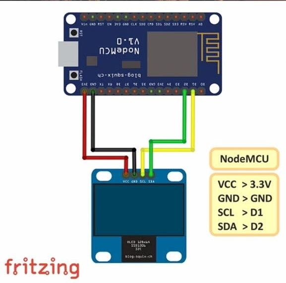

# esp8266_oled_logo

This repository is used for interfacing an OLED 128x64 screen with NodeMCU ESP8266 module showing Custom logos on it.

For complete information regarding this project, please visit: http://hakersparadise.blogspot.com/2019/09/esp8266-weather-monitor.html

## Interfacing of OLED screen with NodeMCU

